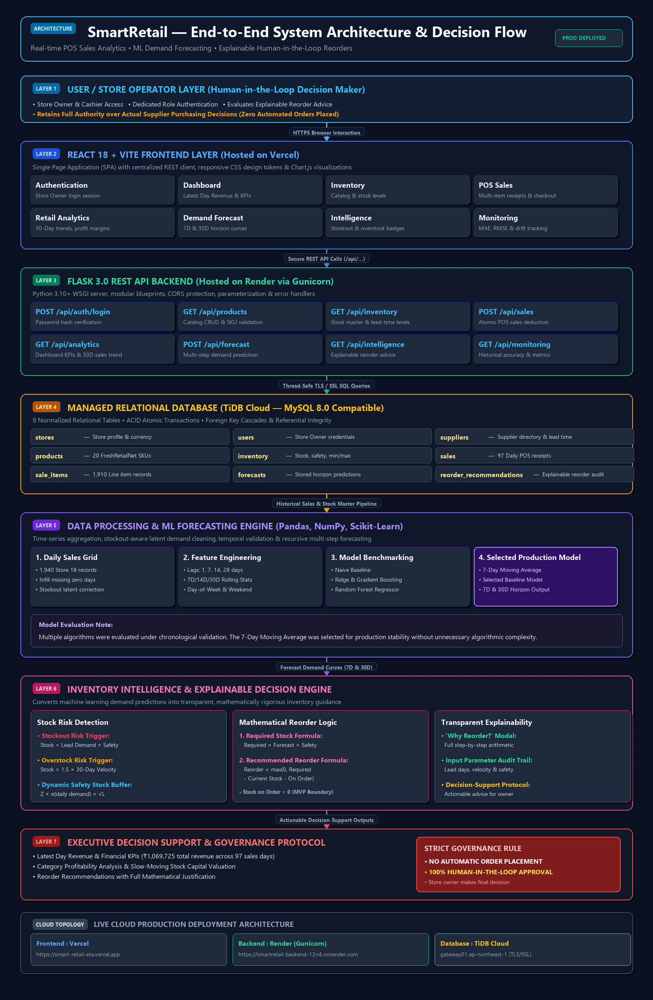

# SmartRetail — Retail Inventory Intelligence & Demand Forecasting Platform

[](https://www.python.org/)
[](https://flask.palletsprojects.com/)
[](https://react.dev/)
[](https://vitejs.dev/)
[-4479A1.svg)](https://tidbcloud.com/)
[](https://scikit-learn.org/)
[]()
[](LICENSE)

**SmartRetail** is an end-to-end retail decision-support platform designed to help retail store owners analyze transactional sales velocity, forecast customer demand using machine learning, detect stockout and overstock risks, and generate transparent, mathematically explainable reorder recommendations.

> **Important Positioning:** SmartRetail is strictly a **decision-support system** designed to assist store owners with data-driven insights. It **never automatically places purchase orders** with suppliers; the store owner remains the final decision maker.

---

## 🏗️ System Architecture

SmartRetail follows an end-to-end decision-support architecture connecting retail sales data, analytics, demand forecasting, inventory risk detection, and explainable reorder recommendations.



### Deployment Architecture

- **Frontend:** React + Vite deployed on **Vercel**
- **Backend:** Flask REST API deployed on **Render**
- **Database:** MySQL-compatible **TiDB Cloud**
- **ML/Data Processing:** Pandas, NumPy, Scikit-learn

> **Important Governance Protocol:** SmartRetail provides recommendations for human review and does not automatically place purchase orders.

---

## 🚀 Live Demo

- **Live Web Application:** [https://smart-retail-eta.vercel.app](https://smart-retail-eta.vercel.app)
- **Live Backend REST API:** [https://smartretail-backend-12n4.onrender.com](https://smartretail-backend-12n4.onrender.com)

### Demo Credentials for Evaluation
| Role | Email | Password | Store Name |
| :--- | :--- | :--- | :--- |
| **Store Owner** | `owner@smartretail.com` | `SmartRetail@123` | *Metro Mart Superstore* |

*Note: The demo credentials above are dedicated for public portfolio and recruiter evaluation. No sensitive production secrets or private credentials are included.*

---

## 📌 Problem Statement

Independent retail store operators face recurring inventory and operational challenges:
- **Sales Velocity Blindspots:** Difficulty identifying which products move quickly versus those tying up working capital.
- **Divergence Between Revenue & Profit:** High-volume items often have low gross margins, while high-margin products can be slow-moving.
- **Stockout Risks:** Running out of inventory before supplier replenishment leads to lost revenue and dissatisfied customers.
- **Overstock & Shrinkage:** Excess inventory increases holding costs and risks spoilage or obsolescence.
- **Demand Uncertainty & Guesswork:** Relying on intuition or simple spreadsheets fails to account for day-of-week trends and lead times.

SmartRetail solves this by unifying transactional POS sales, real-time catalog analytics, time-series demand forecasting, stock risk detection, and transparent reorder explainability into a single, cohesive workflow.

---

## 💡 Solution

SmartRetail connects machine learning predictions directly to actionable inventory decisions:

```
Point of Sale (Sales)
        │
        ▼
TiDB Cloud Relational Database (ACID Transactions)
        │
        ▼
Data Cleaning & Daily Demand Aggregation
        │
        ▼
Time-Series Feature Engineering & ML Forecasting
        │
        ▼
Inventory Risk Detection (Stockout & Overstock)
        │
        ▼
Explainable Reorder Engine (Required Stock - Current Stock - Stock on Order)
        │
        ▼
React Dashboard & Forecast Accuracy Monitoring (MAE, RMSE, WAPE, Bias)
```

Rather than treating machine learning as an isolated exercise that merely outputs a number, SmartRetail integrates forecasting directly into day-to-day retail decision support.

---

## ✨ Key Features

### 1. Sales Management
- Record and inspect multi-item retail sales transactions.
- Supports Cash, Card, and UPI payment methods.
- Atomic inventory deduction: ensures transactions execute cleanly or roll back with zero stock leakage.

### 2. Inventory Management
- Real-time stock level monitoring across the product catalog.
- Stock health statuses: `HEALTHY`, `LOW_STOCK`, `OUT_OF_STOCK`, and `OVERSTOCK`.
- Configurable replenishment parameters: `safety_stock`, `lead_time_days`, `min_stock_level`, and `max_stock_level`.

### 3. Retail Analytics
- **Latest Day Revenue:** Displays revenue and order counts for the latest available business date in the database (rather than defaulting to the computer's calendar date, preserving historical dataset accuracy).
- **30-Day Financial KPIs:** 30-day aggregate revenue, gross profit, profit margins, and total units sold.
- **Multi-Dimensional Rankings:** Distinct views for Best-Sellers (volume), Revenue Leaders, and Profit Leaders.
- **Slow-Moving Inventory Detection:** Flags products with low velocity or dormant sales over 30 days along with inventory holding value.
- **Category Performance & Trends:** Interactive 30-day sales and revenue trend line/area charts.

### 4. Demand Forecasting
- Recursive multi-step demand forecasting across 7-day and 30-day horizons.
- Time-aware chronological validation preventing future data leakage.
- Time-series feature engineering: lag observations (Lag-1, Lag-7, Lag-14, Lag-28), rolling window statistics (7D, 14D, 30D means and standard deviations), and calendar indicators.
- **Model Evaluation:** The pipeline benchmarked multiple models (Naive, 7-day Moving Average, Ridge Regression, Gradient Boosting, and Random Forest). The current deployment uses the **7-day Moving Average** baseline model, demonstrating pragmatic model evaluation over unneeded algorithmic complexity.

### 5. Inventory Intelligence
- **Stockout Risk:** Flags products where $\text{Current Stock} < \text{Lead-Time Demand} + \text{Safety Stock}$.
- **Overstock Risk:** Flags products where $\text{Current Stock} > \text{30-Day Demand} \times 1.5$.
- **Dynamic Safety Stock:** Volatility-adjusted buffer based on demand variation and replenishment lead times.

### 6. Explainable Recommendations
Every suggested reorder includes a clear mathematical breakdown:

$$\text{Required Stock} = \text{Forecast Horizon Demand} + \text{Safety Stock}$$

$$\text{Recommended Reorder} = \max(0, \text{Required Stock} - \text{Current Stock} - \text{Stock on Order})$$

- Interactive **"Why Reorder?"** explainability modal shows exact input parameters, lead-time assumptions, and formula steps.
- **Human-in-the-Loop Protocol:** The system presents advice; the store owner retains complete discretion over supplier orders.

### 7. Forecast Monitoring & Drift Tracking
- Compares predictions against actual recorded sales once target dates conclude.
- Evaluates **Mean Absolute Error (MAE)**, **Root Mean Squared Error (RMSE)**, **Weighted Absolute Percentage Error (WAPE %)**, and **Forecast Bias** (+/- direction).

---

## 📊 Dataset

SmartRetail integrates a real-world retail dataset derived from [FreshRetailNet-50K](https://huggingface.co/datasets/Dingdong-Inc/FreshRetailNet-50K):

- **Store:** Store 18
- **Products:** 20 distinct products across 8 retail categories (Grains, Snacks, Beverages, Personal Care, Household, Produce, Dairy, Bakery)
- **Date Range:** 2024-03-28 to 2024-07-02 (97 consecutive days)
- **Product-Day Grid:** 1,940 continuous product-day observations
- **Sales Receipts:** 97 daily POS receipts
- **Sale Line Items:** 1,910 itemized purchase records
- **Total Observed Units Sold:** 7,037 units
- **Stockout Latent Demand Handling:** Stockout-censored zero-sales days are identified to ensure demand forecasts reflect true consumer intent rather than physical unavailability.

> **Date Handling Note:** Because the dataset contains historical sales up to July 2024, the dashboard dynamically anchors all financial and trend calculations to the latest available business date in the database.

---

## 🧠 Machine Learning Pipeline

1. **Data Preparation:** Ingest historical transaction records and create a continuous daily sales grid.
2. **Demand Aggregation:** Aggregate item-level daily unit demand per product SKU.
3. **Stockout-Aware Cleaning:** Correct for zero-sales intervals caused by stockouts to avoid downward forecast bias.
4. **Feature Engineering:** Compute lag features (1, 7, 14, 28 days), rolling averages, rolling standard deviations, day-of-week, and weekend indicators.
5. **Model Evaluation & Selection:** Compare multiple models (Naive, Moving Average, Ridge, Gradient Boosting, Random Forest) using temporal splits.
6. **Chronological Validation:** Validate on out-of-time test windows with strict temporal separation.
7. **Forecast Generation:** Generate multi-step recursive demand forecasts for 7-day and 30-day horizons.
8. **Decision Support Integration:** Feed forecast horizons into the Inventory Intelligence engine to compute safety stock buffers and reorder quantities.

---

## 🏗️ System Architecture

```
┌─────────────────────────────────────────────────────────────┐
│                   React 18 + Vite Frontend                  │
│                     (Hosted on Vercel)                      │
└──────────────────────────────┬──────────────────────────────┘
                               │ HTTPS REST API Calls
                               ▼
┌─────────────────────────────────────────────────────────────┐
│                    Flask 3.0 WSGI Backend                   │
│              (Hosted on Render via Gunicorn)                │
│  - REST API Routing (/api/...)                              │
│  - ML Demand Forecasting Engine (Scikit-Learn / Pandas)     │
│  - Inventory Intelligence & Explainability Service          │
│  - Historical Forecast Accuracy Monitoring                  │
└──────────────────────────────┬──────────────────────────────┘
                               │ Parameterized SQL over TLS/SSL
                               ▼
┌─────────────────────────────────────────────────────────────┐
│                 TiDB Cloud Managed Database                 │
│                 (MySQL 8.0 Compatible Engine)               │
│  - 9 Relational Tables with Foreign Key Integrity           │
│  - ACID Transactions & Atomic Inventory Updates             │
└─────────────────────────────────────────────────────────────┘
```

---

## 🛠️ Technology Stack

| Layer | Technology | Purpose |
| :--- | :--- | :--- |
| **Frontend** | **React 18**, **Vite 5**, **JavaScript** | Responsive Single Page Application |
| **Styling & UI** | **Vanilla CSS (Design Tokens)**, **Lucide React** | Dark-themed, accessible UI system |
| **Visualizations** | **Chart.js**, **react-chartjs-2** | Interactive trend lines, bar charts, and doughnut breakdowns |
| **Backend API** | **Python 3.10+**, **Flask 3.0+** | Modular Blueprint REST API with thread-safe connections |
| **WSGI Server** | **Gunicorn** | Production WSGI web server |
| **Database** | **TiDB Cloud (MySQL 8.0 compatible)** | Managed relational database with TLS/SSL encryption |
| **Data & ML** | **Pandas**, **NumPy**, **Scikit-learn** | Time-series feature engineering and model evaluation |
| **Testing** | **Pytest** | Automated unit, integration, and system test suite |
| **Deployment** | **Vercel** (Frontend), **Render** (Backend), **TiDB Cloud** (Database) | Production cloud hosting architecture |

---

## 🗄️ Database Schema

The relational database consists of 9 normalized tables:

1. `stores`: Retail store profile, ownership, currency, and operational parameters.
2. `users`: Store owner login credentials with password hashing and session management.
3. `suppliers`: Supplier directory, contact information, and delivery lead times in days.
4. `products`: Master catalog with SKU, product name, category, cost price, and selling price.
5. `inventory`: Stock records with safety stock, min/max thresholds, and supplier lead times.
6. `sales`: Transaction headers recording receipt numbers, total amounts, and payment methods.
7. `sale_items`: Line-item details storing item quantity, unit price, and historical unit cost.
8. `forecasts`: Stored multi-step predictions for reconciliation against actual demand.
9. `reorder_recommendations`: Persisted inventory intelligence outputs with explainability audit trails.

---

## 🔐 Authentication & Security

- **Role-Based Store Owner Access:** Dedicated login portal for store operations.
- **Hashed Password Storage:** Passwords hashed with standard security algorithms.
- **REST API Guardrails:** Parameterized SQL queries preventing SQL injection vulnerabilities.
- **Environment Isolation:** Secrets, keys, and database credentials are fully parameterized through environment variables and never committed to source control.

---

## 📐 Core Business Logic & Formulas

| Metric / Decision | Formula | Purpose |
| :--- | :--- | :--- |
| **Revenue** | $\sum (\text{quantity} \times \text{unit\_price})$ | Total top-line sales value |
| **Gross Profit** | $\sum (\text{quantity} \times (\text{unit\_price} - \text{unit\_cost}))$ | Realized gross earnings |
| **Gross Margin %** | $\frac{\text{Gross Profit}}{\text{Revenue}} \times 100$ | Margin efficiency percentage |
| **Stockout Risk** | $\text{Current Stock} < \text{Lead-Time Demand} + \text{Safety Stock}$ | Early stockout warning |
| **Required Stock** | $\text{Forecast Horizon Demand} + \text{Safety Stock}$ | Target stock level |
| **Recommended Reorder** | $\max(0, \text{Required Stock} - \text{Current Stock} - \text{Stock on Order})$ | Suggests replenishment units |
| **Best-Sellers** | $\text{Rank by } \sum \text{quantity}$ | Volume movement ranking |

---

## 🧪 Testing & Validation

- **Backend Automated Tests:** **83 tests passed out of 83 (100% pass rate)**.
  - Covers authentication, product CRUD, POS transactions, inventory deduction, analytics calculations, forecasting pipeline, explainability logic, and monitoring metrics.
- **Frontend Production Build:** `npm run build` succeeds cleanly (1,523 modules transformed, 0 bundle errors).

To run backend tests:
```bash
cd backend
pytest
```

To run frontend build:
```bash
cd frontend
npm run build
```

---

## 📁 Project Structure

```
smartRetail/
├── backend/
│   ├── app/
│   │   ├── routes/              # Flask Blueprints (analytics, auth, forecast, health, inventory, monitoring, products, sales)
│   │   ├── services/            # Business logic (forecast, inventory intelligence, monitoring)
│   │   ├── __init__.py          # Flask application factory
│   │   └── db.py                # Database connection layer with TLS/SSL support
│   ├── database/
│   │   ├── schema.sql           # 9-table DDL schema
│   │   ├── seed.sql             # FreshRetailNet-50K seed dataset
│   │   └── init_db.py           # Automated cloud DB initialization script
│   ├── ml/
│   │   ├── saved_models/        # Saved model artifacts & evaluation metadata
│   │   ├── data_loader.py       # Data loader & cleaning
│   │   ├── preprocessing.py    # Time-series feature engineering
│   │   └── forecasting.py       # Multi-step forecasting logic
│   ├── tests/                   # 83 Pytest automated test suites
│   ├── config.py                # Environment-driven configuration
│   ├── requirements.txt         # Python dependencies
│   ├── run.py                   # Local development server entrypoint
│   └── wsgi.py                  # Production Gunicorn entrypoint
├── frontend/
│   ├── public/                  # Static assets & brand icons
│   ├── src/
│   │   ├── components/          # Reusable UI components (Sidebar, Navbar, KpiCard, Badge, Modal)
│   │   ├── pages/               # Views (Dashboard, Inventory, Sales, Analytics, Forecast, Intelligence, Monitoring, Login)
│   │   ├── services/            # Centralized REST API client
│   │   ├── App.jsx              # Main router & layout container
│   │   └── main.jsx             # React DOM entrypoint
│   ├── package.json             # NPM dependencies
│   ├── vercel.json              # Vercel SPA routing rewrite rules
│   └── vite.config.js           # Vite build configuration
├── docs/                        # Technical documentation & guides
├── .env.example                 # Example environment variable template
├── .gitignore                   # Git ignore rules
└── README.md                    # Project documentation
```

---

## ⚙️ Local Setup & Installation

### Prerequisites
- Python 3.10+
- Node.js 18+
- MySQL 8.0+ or TiDB Cloud instance
- Git

### 1. Clone Repository
```bash
git clone https://github.com/gunadeepthi-4588/smartRetail.git
cd smartRetail
```

### 2. Backend Setup
```bash
cd backend
python -m venv venv

# Windows:
venv\Scripts\activate
# macOS/Linux:
# source venv/bin/activate

pip install -r requirements.txt
cp .env.example .env
# Configure your DB_HOST, DB_PORT, DB_USER, DB_PASSWORD, DB_NAME in backend/.env

# Initialize database schema and seed data
python database/init_db.py

# Start backend server
python run.py
# Backend runs at http://localhost:5000
```

### 3. Frontend Setup
```bash
cd ../frontend
npm install
cp .env.example .env
# Ensure VITE_API_BASE_URL=http://localhost:5000/api in frontend/.env

npm run dev
# Frontend runs at http://localhost:5173
```

---

## ☁️ Production Deployment

SmartRetail is deployed across modern cloud platforms:

- **Frontend:** Deployed on **Vercel** with global CDN caching and client-side SPA routing (`vercel.json`).
- **Backend:** Deployed on **Render** running **Gunicorn** WSGI workers (`wsgi:app`).
- **Database:** Managed **TiDB Cloud** MySQL-compatible relational database with TLS/SSL encryption.

---

## ⚠️ Limitations

- **Historical Dataset:** Predictions and analytics are based on the FreshRetailNet-50K historical retail window.
- **Single-Store Decision Support:** Current MVP scope models a single retail storefront operator.
- **Stock-on-Order Tracking:** The MVP focuses on required stock and reorder calculation; real-time purchase order delivery tracking is out of scope.
- **Advisory Forecasts:** Forecasts and reorder numbers are decision-support estimates to guide the merchant, not absolute guarantees.
- **No Automated Ordering:** The system does not directly interact with supplier APIs or place purchase orders without human approval.

---

## 🔮 Future Enhancements

- **Multi-Location Inventory Balancing:** Inter-branch transfers and multi-warehouse distribution.
- **Purchase Order Tracking:** Full supplier purchase order lifecycle management from draft to fulfillment.
- **Supplier Performance Scorecards:** Lead-time reliability and fulfillment accuracy analytics.
- **Automated Ingestion Pipelines:** Real-time POS webhooks and streaming transaction ingestion.
- **Advanced Forecast Models:** Evaluating deep learning architectures (e.g., Temporal Fusion Transformers) as data scales.
- **Automated Alerts:** Email and SMS notifications for low-stock and stockout conditions.
- **Role-Based Access Control (RBAC):** Separate permissions for Cashiers, Inventory Managers, and Store Owners.

---

## 👩‍💻 Author

**Guna Deepthi**
- **GitHub:** [https://github.com/gunadeepthi-4588](https://github.com/gunadeepthi-4588)
- **Repository:** [https://github.com/gunadeepthi-4588/smartRetail](https://github.com/gunadeepthi-4588/smartRetail)

---

## 📄 License

This project is licensed under the [MIT License](LICENSE).
