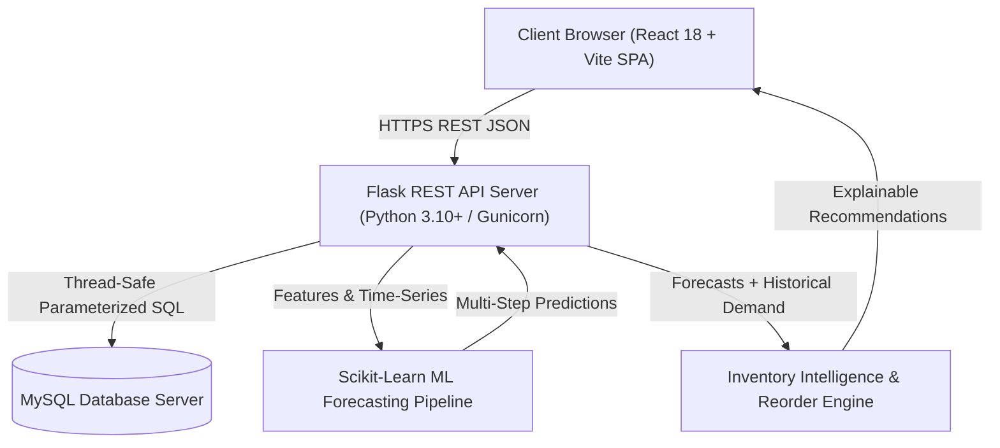
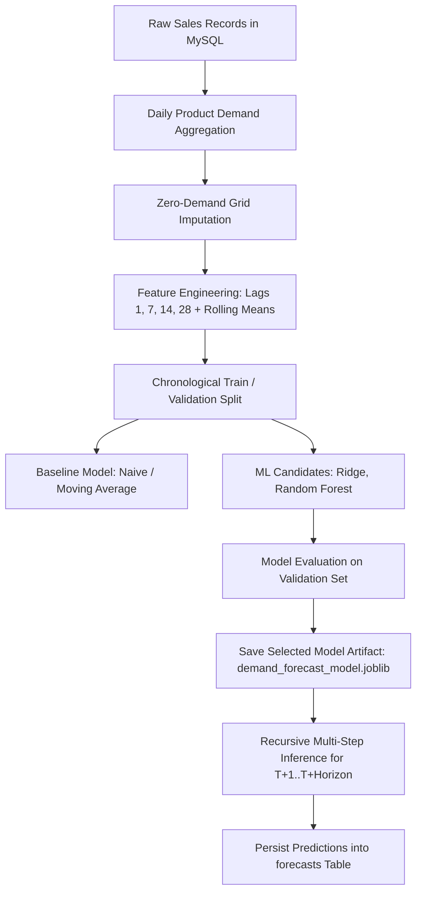
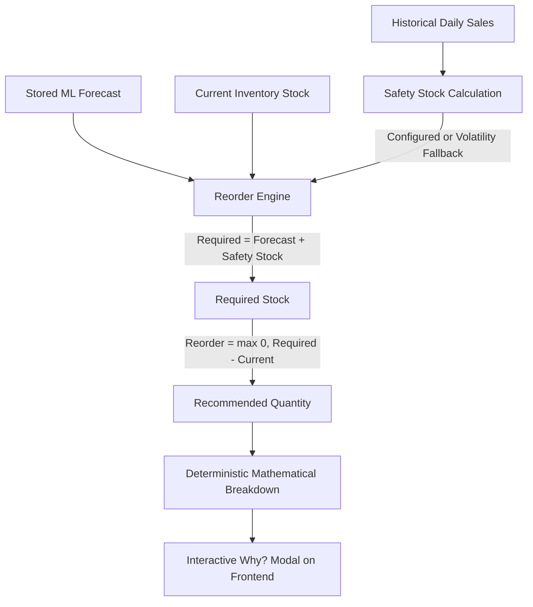
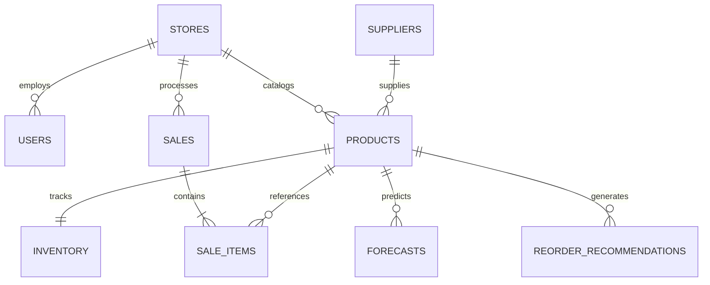

# SmartRetail — System Architecture & Component Design

## 1. High-Level Architecture

SmartRetail implements a decoupled, modern 3-tier web architecture:



---

## 2. Frontend Architecture (React SPA)

The frontend is structured into modular layers:

- **Routing & State**: Single-page navigation managing `/login`, `/dashboard`, `/inventory`, `/sales`, `/analytics`, `/forecast`, `/monitoring`, and `/settings`.
- **UI Components**:
  - `components/layout/`: `AppLayout`, `Sidebar`, `Header`
  - `components/common/`: `KpiCard`, `Badge`, `Modal`
  - `pages/`: Dedicated business views
- **API Client Service (`src/services/api.js`)**:
  - Centralized abstraction utilizing `fetchApi`
  - Switches automatically between local `/api` proxy and cloud HTTPS base URL (`VITE_API_BASE_URL`)
  - Intercepts and parses backend error responses without crashing the UI

---

## 3. Backend Architecture (Flask REST API)

The backend follows the Application Factory pattern:

```
backend/
├── app/
│   ├── routes/                # REST API Blueprints
│   │   ├── health.py          # /api/health, /api/health/db
│   │   ├── products.py        # /api/products CRUD
│   │   ├── inventory.py       # /api/inventory management
│   │   ├── sales.py           # /api/sales atomic POS
│   │   ├── analytics.py       # /api/analytics KPIs & trends
│   │   ├── forecast.py        # /api/forecast generation & retrieval
│   │   ├── recommendations.py # /api/recommendations & intelligence
│   │   └── monitoring.py      # /api/monitoring accuracy tracking
│   ├── services/              # Business Logic & Algorithms
│   │   ├── forecast_service.py
│   │   ├── inventory_intelligence_service.py
│   │   └── monitoring_service.py
│   ├── db.py                  # PyMySQL connection pool & teardown
│   └── __init__.py            # Flask app factory with CORS & error handlers
├── ml/                        # Machine Learning Pipeline
│   ├── data_loader.py         # Daily sales aggregation
│   ├── features.py            # Lag and rolling feature engineering
│   ├── models.py              # Candidate regressors
│   ├── train.py               # Temporal validation & artifact generation
│   └── saved_models/          # Pre-trained .joblib artifacts
├── database/                  # Schema, Seed & Init Scripts
└── wsgi.py                    # Gunicorn production entry point
```

---

## 4. Machine Learning & Forecasting Workflow



---

## 5. Inventory Intelligence & Explainability Engine



---

## 6. Database Relationship Architecture


