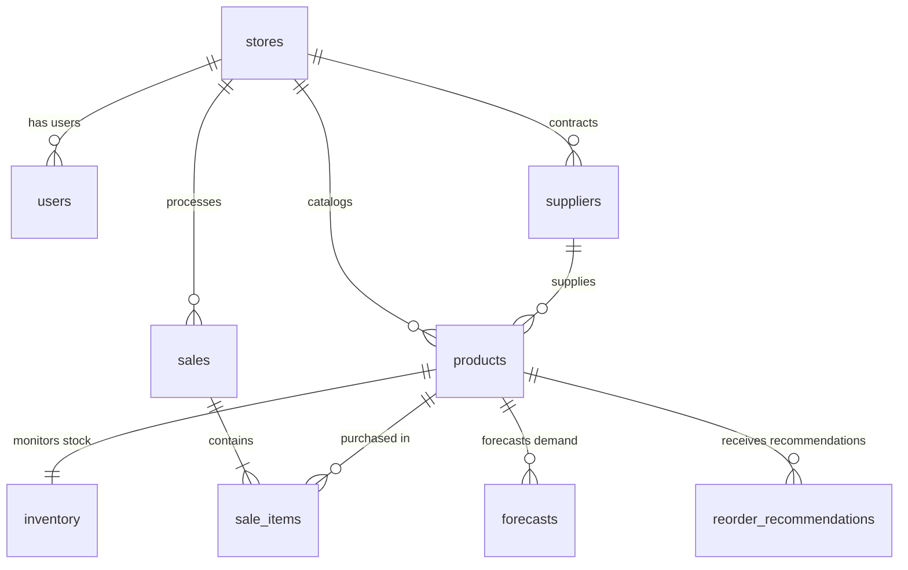

# SmartRetail — Database Architecture & Schema Specification

## 1. Database Overview

- **RDBMS**: MySQL 8.0+ / InnoDB
- **Character Set**: `utf8mb4`
- **Collation**: `utf8mb4_unicode_ci`
- **Isolation Level**: Read Committed / Repeatable Read
- **Transactions**: Atomic ACID guarantees with foreign key cascade/restrict integrity

---

## 2. Relational Schema & Table Definitions

SmartRetail utilizes 9 core relational tables designed for multi-table consistency and analytics integrity.

---

### Table 1: `stores`
Stores store-level metadata and currency localization.

| Column | Type | Constraints | Description |
| :--- | :--- | :--- | :--- |
| `store_id` | `INT` | `AUTO_INCREMENT PRIMARY KEY` | Unique store identifier |
| `name` | `VARCHAR(100)` | `NOT NULL` | Store business name |
| `owner_name` | `VARCHAR(100)` | `NOT NULL` | Store owner / primary contact |
| `currency` | `VARCHAR(10)` | `NOT NULL DEFAULT 'INR'` | ISO currency code |
| `currency_symbol` | `VARCHAR(5)` | `NOT NULL DEFAULT '₹'` | Currency display symbol |
| `created_at` | `TIMESTAMP` | `DEFAULT CURRENT_TIMESTAMP` | Record creation timestamp |

---

### Table 2: `users`
Manages store owner authentication and credential security.

| Column | Type | Constraints | Description |
| :--- | :--- | :--- | :--- |
| `user_id` | `INT` | `AUTO_INCREMENT PRIMARY KEY` | Unique user identifier |
| `store_id` | `INT` | `NOT NULL, FK -> stores(store_id)` | Associated store |
| `username` | `VARCHAR(50)` | `NOT NULL UNIQUE` | Unique username |
| `password_hash` | `VARCHAR(255)` | `NOT NULL` | PBKDF2:SHA256 password hash |
| `email` | `VARCHAR(100)` | `NOT NULL UNIQUE` | Contact and login email |
| `created_at` | `TIMESTAMP` | `DEFAULT CURRENT_TIMESTAMP` | Account creation timestamp |

---

### Table 3: `suppliers`
Tracks product suppliers and supplier lead times.

| Column | Type | Constraints | Description |
| :--- | :--- | :--- | :--- |
| `supplier_id` | `INT` | `AUTO_INCREMENT PRIMARY KEY` | Unique supplier identifier |
| `store_id` | `INT` | `NOT NULL, FK -> stores(store_id)` | Associated store |
| `name` | `VARCHAR(100)` | `NOT NULL` | Supplier company name |
| `contact_name` | `VARCHAR(100)` | `NULL` | Point of contact |
| `email` | `VARCHAR(100)` | `NULL` | Supplier email |
| `phone` | `VARCHAR(20)` | `NULL` | Supplier phone |
| `lead_time_days` | `INT` | `NOT NULL DEFAULT 3` | Procurement delivery lead time in days |
| `created_at` | `TIMESTAMP` | `DEFAULT CURRENT_TIMESTAMP` | Supplier registration timestamp |

---

### Table 4: `products`
Product catalog with pricing, category, and SKU index.

| Column | Type | Constraints | Description |
| :--- | :--- | :--- | :--- |
| `product_id` | `INT` | `AUTO_INCREMENT PRIMARY KEY` | Unique product identifier |
| `store_id` | `INT` | `NOT NULL, FK -> stores(store_id)` | Associated store |
| `supplier_id` | `INT` | `NULL, FK -> suppliers(supplier_id)` | Default supplier |
| `sku` | `VARCHAR(50)` | `NOT NULL UNIQUE` | Stock Keeping Unit |
| `name` | `VARCHAR(150)` | `NOT NULL` | Product name |
| `category` | `VARCHAR(50)` | `NOT NULL` | Product category (e.g. Dairy, Snacks) |
| `cost_price` | `DECIMAL(10,2)` | `NOT NULL` | Unit cost price |
| `selling_price` | `DECIMAL(10,2)` | `NOT NULL` | Unit selling price |
| `created_at` | `TIMESTAMP` | `DEFAULT CURRENT_TIMESTAMP` | Creation timestamp |

---

### Table 5: `inventory`
Tracks active stock levels, min/max thresholds, safety stock, and lead times.

| Column | Type | Constraints | Description |
| :--- | :--- | :--- | :--- |
| `inventory_id` | `INT` | `AUTO_INCREMENT PRIMARY KEY` | Unique inventory record ID |
| `product_id` | `INT` | `NOT NULL UNIQUE, FK -> products(product_id)` | Product reference |
| `current_stock` | `INT` | `NOT NULL DEFAULT 0` | Available stock in units |
| `min_stock_level` | `INT` | `NOT NULL DEFAULT 10` | Low-stock alert threshold |
| `max_stock_level` | `INT` | `NOT NULL DEFAULT 200` | Overstock upper threshold |
| `safety_stock` | `INT` | `NOT NULL DEFAULT 20` | Buffer stock for demand volatility |
| `lead_time_days` | `INT` | `NOT NULL DEFAULT 3` | Supplier replenishment lead time |
| `last_updated` | `TIMESTAMP` | `DEFAULT CURRENT_TIMESTAMP ON UPDATE` | Last inventory update timestamp |

---

### Table 6: `sales`
Header records for retail point-of-sale transactions.

| Column | Type | Constraints | Description |
| :--- | :--- | :--- | :--- |
| `sale_id` | `INT` | `AUTO_INCREMENT PRIMARY KEY` | Unique sale transaction ID |
| `store_id` | `INT` | `NOT NULL, FK -> stores(store_id)` | Associated store |
| `receipt_number` | `VARCHAR(50)` | `NOT NULL UNIQUE` | Generated receipt number |
| `total_amount` | `DECIMAL(10,2)` | `NOT NULL` | Total transaction amount |
| `payment_method` | `VARCHAR(30)` | `NOT NULL DEFAULT 'Cash'` | Cash, Card, or UPI |
| `sale_date` | `DATETIME` | `NOT NULL DEFAULT CURRENT_TIMESTAMP` | Transaction datetime |

---

### Table 7: `sale_items`
Line items associated with each sale transaction.

| Column | Type | Constraints | Description |
| :--- | :--- | :--- | :--- |
| `sale_item_id` | `INT` | `AUTO_INCREMENT PRIMARY KEY` | Line item identifier |
| `sale_id` | `INT` | `NOT NULL, FK -> sales(sale_id)` | Sale transaction |
| `product_id` | `INT` | `NOT NULL, FK -> products(product_id)` | Product purchased |
| `quantity` | `INT` | `NOT NULL` | Units sold |
| `unit_price` | `DECIMAL(10,2)` | `NOT NULL` | Selling price at time of sale |
| `unit_cost` | `DECIMAL(10,2)` | `NOT NULL` | Cost price at time of sale |

---

### Table 8: `forecasts`
Stores multi-step machine learning demand predictions.

| Column | Type | Constraints | Description |
| :--- | :--- | :--- | :--- |
| `forecast_id` | `INT` | `AUTO_INCREMENT PRIMARY KEY` | Forecast record identifier |
| `product_id` | `INT` | `NOT NULL, FK -> products(product_id)` | Product predicted |
| `forecast_date` | `DATE` | `NOT NULL` | Date when forecast was generated |
| `target_date` | `DATE` | `NOT NULL` | Target future prediction date |
| `predicted_demand`| `DECIMAL(10,2)`| `NOT NULL` | Predicted demand units |
| `actual_demand` | `DECIMAL(10,2)`| `NULL DEFAULT NULL` | Actual sales reconciled later |
| `model_name` | `VARCHAR(50)` | `NOT NULL` | Model identifier (e.g. RandomForest) |
| `horizon_days` | `INT` | `NOT NULL` | Forecast horizon (7 or 30 days) |
| `created_at` | `TIMESTAMP` | `DEFAULT CURRENT_TIMESTAMP` | Prediction timestamp |

---

### Table 9: `reorder_recommendations`
Stores automated inventory replenishment recommendations.

| Column | Type | Constraints | Description |
| :--- | :--- | :--- | :--- |
| `recommendation_id` | `INT` | `AUTO_INCREMENT PRIMARY KEY` | Unique recommendation identifier |
| `product_id` | `INT` | `NOT NULL, FK -> products(product_id)` | Product referenced |
| `calculation_date` | `DATE` | `NOT NULL` | Recommendation calculation date |
| `predicted_demand` | `DECIMAL(10,2)` | `NOT NULL` | Total forecasted demand over horizon |
| `current_stock` | `INT` | `NOT NULL` | Current stock at calculation time |
| `safety_stock` | `INT` | `NOT NULL` | Safety buffer units |
| `lead_time_demand` | `DECIMAL(10,2)` | `NOT NULL` | Demand during procurement lead time |
| `recommended_quantity`| `INT` | `NOT NULL` | Calculated order quantity |
| `status` | `VARCHAR(20)` | `NOT NULL DEFAULT 'Pending'` | Pending, Reviewed, Dismissed |
| `created_at` | `TIMESTAMP` | `DEFAULT CURRENT_TIMESTAMP` | Calculation timestamp |

---

## 3. Atomic POS Transaction Execution

When a checkout transaction occurs, the backend executes an atomic ACID transaction:

1. **Verify Stock**: Ensures `current_stock >= requested_quantity` for every item.
2. **Insert Header**: Writes to `sales` table.
3. **Insert Line Items**: Writes all items to `sale_items`.
4. **Deduct Stock**: Updates `inventory.current_stock = current_stock - quantity`.
5. **Commit/Rollback**: Commits only if all steps succeed; performs immediate rollback on any constraint error.
