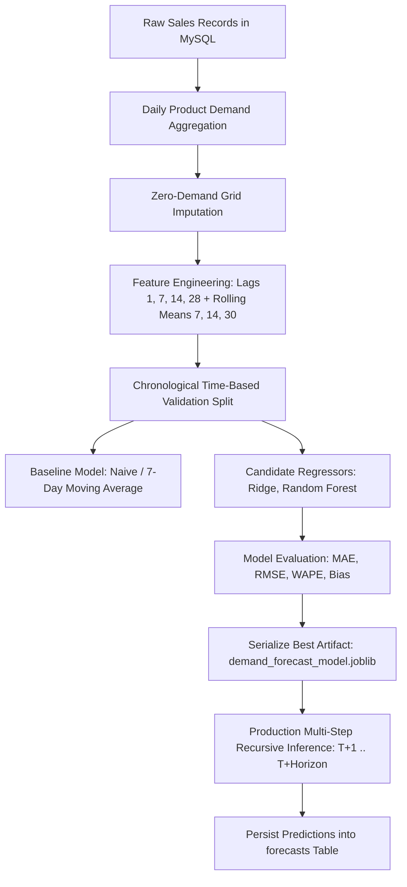

# SmartRetail — Machine Learning Demand Forecasting Pipeline

## 1. Overview & Objectives

The SmartRetail Machine Learning pipeline predicts future SKU-level daily sales demand across multi-step horizons (7-day and 30-day). It replaces naive guesswork with data-driven predictive inventory planning.

---

## 2. End-to-End Pipeline Architecture

---

## 3. Data Ingestion & Preprocessing

1. **Daily Demand Aggregation (`backend/ml/data_loader.py`)**:
   - Queries `sales` and `sale_items` to group total quantity by `(product_id, sale_date)`.
2. **Zero-Demand Grid Creation**:
   - Retail sales are intermittent. If a product has no sales on a specific date, it is assigned `quantity = 0` rather than dropping the date.
3. **Data Quality Checks**:
   - Rejects negative quantities and infills missing intermediate timestamps across the historical range.

---

## 4. Feature Engineering (`backend/ml/features.py`)

To ensure robust time-series forecasting without data leakage:

| Feature Category | Features | Purpose |
| :--- | :--- | :--- |
| **Lag Features** | `lag_1`, `lag_7`, `lag_14`, `lag_28` | Captures immediate past demand, weekly seasonality, and monthly periodicity |
| **Rolling Means** | `rolling_mean_7`, `rolling_mean_14`, `rolling_mean_30` | Smooths short-term demand volatility and trends |
| **Rolling Std** | `rolling_std_7`, `rolling_std_14` | Quantifies demand variance and uncertainty |
| **Calendar Signals** | `day_of_week`, `day_of_month`, `month`, `is_weekend` | Models recurring day-of-week retail traffic spikes |

---

## 5. Model Training & Evaluation (`backend/ml/train.py`)

### Validation Strategy:
- Strict **Chronological Train/Validation Split** (first 80% of days for training, last 20% for testing) to prevent temporal leakage.

### Evaluation Metrics:
- **MAE (Mean Absolute Error)**: $\frac{1}{N} \sum |y_i - \hat{y}_i|$
- **RMSE (Root Mean Squared Error)**: $\sqrt{\frac{1}{N} \sum (y_i - \hat{y}_i)^2}$
- **WAPE (Weighted Absolute Percentage Error)**: $\frac{\sum |y_i - \hat{y}_i|}{\sum y_i} \times 100\%$ (robust against zero-demand denominators)
- **Forecast Bias (Tracking Signal)**: $\frac{\sum (\hat{y}_i - y_i)}{\sum y_i} \times 100\%$

### Model Selection:
The pipeline trains baseline benchmarks (Naive, Moving Average) and machine learning regressors (Ridge, Random Forest Regressor). The model with lowest WAPE and balanced bias is serialized to `backend/ml/saved_models/demand_forecast_model.joblib`.

---

## 6. Multi-Step Production Inference (`backend/app/services/forecast_service.py`)

- **Recursive Forecasting**: Generates forecasts day-by-day ($T+1, T+2, \dots, T+N$), using predictions as lag inputs for subsequent future steps.
- **Fallback for Low History**: For newly introduced items with fewer than 7 days of sales history, the system seamlessly applies a category moving-average heuristic.
- **Persistence**: Results are written to `forecasts` table with `actual_demand = NULL` until actual sales occur.
