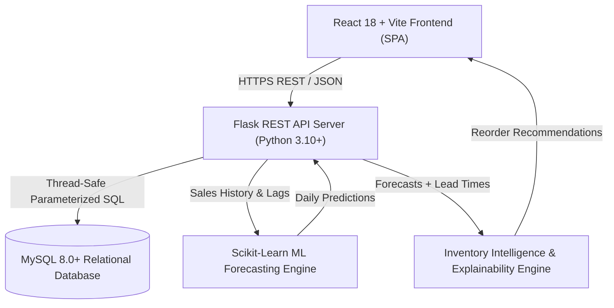

# SmartRetail — Comprehensive Project Explanation

*A complete project overview prepared for Computer Science & Data Science final-year evaluation.*

---

## 1. Introduction & Problem Statement

Retail store owners face a critical daily challenge: **how much inventory should they order?**

### The Existing Problem:
- **Under-ordering (Stockouts)**: When popular products run out of stock, customers leave disappointed, leading to immediate lost revenue and customer churn.
- **Over-ordering (Overstocking)**: Excess inventory ties up vital working capital, takes up scarce shelf space, and leads to expired goods (especially in dairy, staples, and fresh foods).
- **Manual Heuristics**: Most small to mid-sized retailers rely on gut feeling, paper logbooks, or simple static spreadsheets that cannot capture seasonality, trends, or supplier lead times.

### The Proposed Solution:
**SmartRetail** is an intelligent, full-stack retail management web application that integrates:
1. Fast Point-of-Sale (POS) transaction recording.
2. Relational database storage with atomic ACID guarantees in MySQL.
3. Machine Learning time-series demand forecasting using Random Forest regression.
4. Intelligent replenishment calculations accounting for lead time and safety stock.
5. Deterministic, transparent mathematical explainability ("Why?" breakdown modal).
6. Continuous forecast accuracy monitoring (MAE, RMSE, WAPE %, Forecast Bias).

---

## 2. Key Objectives

1. **Automate Inventory Visibility**: Real-time tracking of current stock against minimum and maximum thresholds.
2. **Accurate Demand Prediction**: Generate 7-day and 30-day SKU-level demand predictions using lag features and rolling statistical averages.
3. **Prevent Supply Chain Failures**: Automatically detect stockout risk and calculate exact reorder quantities before stock runs dry.
4. **Build Trust Through Explainability**: Provide transparent mathematical justifications for every replenishment recommendation.
5. **Ensure Enterprise Security**: Implement PBKDF2 password hashing, store data isolation, and protected REST APIs.

---

## 3. System Architecture & Technical Stack

### Technology Breakdown:
- **Frontend**: React 18, Vite, Chart.js, Lucide Icons, Vanilla CSS Design System.
- **Backend**: Python Flask 3.0, Gunicorn WSGI, Werkzeug Security, Flask-CORS.
- **Database**: MySQL 8.0+ with InnoDB engine, 9 normalized tables.
- **Machine Learning**: Scikit-Learn (Random Forest Regressor), Pandas, NumPy, Joblib.
- **Testing**: Pytest (80 automated unit & integration tests).

---

## 4. Machine Learning & Demand Forecasting Pipeline

### Data Preparation:
- Aggregates historical transactions from `sales` and `sale_items` into daily SKU sales.
- Injects a **zero-demand grid** to explicitly handle days where zero units were sold.

### Feature Engineering:
- **Lag Features**: $t-1, t-7, t-14, t-28$ (capturing weekly seasonality and monthly cycles).
- **Rolling Windows**: 7-day, 14-day, and 30-day moving averages and standard deviations.
- **Temporal Splitting**: Chronological 80/20 train-test split preventing future data leakage.

### Model Selection & Inference:
- Benchmarked against baseline heuristics (Naive & Moving Average).
- Random Forest Regressor selected for superior non-linear modeling and robustness against intermittent spikes.
- Pre-trained model artifact (`demand_forecast_model.joblib`) serialized for instant millisecond inference.

---

## 5. Inventory Intelligence & Business Formulas

### Stockout Risk:
Occurs when available stock cannot cover demand during the supplier delivery window:
$$\text{Stockout Risk} = \text{Current Stock} \le \text{Lead-Time Demand} + \text{Safety Stock}$$

### Recommended Order Quantity:
$$Q = \max\Big(0,\; \lceil (\text{Forecasted Demand} + \text{Safety Stock}) - \text{Current Stock} - \text{Stock on Order} \rceil\Big)$$

### Explainable Decision Support:
Clicking the "Why?" button opens a breakdown modal that details:
1. Total forecasted demand over the selected horizon.
2. Estimated unit sales during the 3-day supplier lead time.
3. Required safety stock buffer based on demand volatility.
4. Current available inventory.
5. Step-by-step arithmetic yielding the final recommended order quantity.

---

## 6. Testing, Quality Assurance & Security

- **Test Suite**: 80/80 automated test cases passing in Pytest covering API health, atomic rollbacks, business formulas, ML pipeline data integrity, and inventory intelligence.
- **Production Build**: `npm run build` succeeds cleanly producing a minified production bundle in `dist/`.
- **Security Guardrails**:
  - Zero plaintext passwords (PBKDF2:SHA256 hashing).
  - Parameterized SQL queries preventing SQL injection.
  - Zero exposed secrets in Git (environment variables strictly managed).
  - Frontend never communicates directly with the database.

---

## 7. Limitations & Future Scope

### Current Limitations (MVP Scope):
- Focused on single-store retail operations.
- Human-in-the-loop decision support (system recommends; store owner confirms purchase orders).

### Future Roadmap:
- Multi-warehouse inventory synchronization.
- Barcode scanning camera support for POS checkout.
- Automated purchase order PDF generation and supplier email dispatch.
- Integration of external features such as promotional calendars, holidays, and weather signals.
