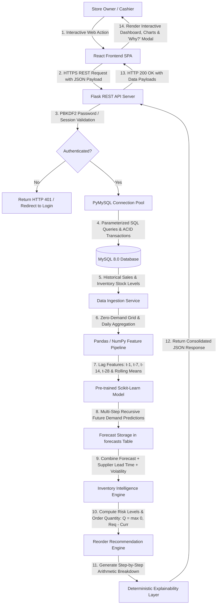

# SmartRetail — End-to-End Technical Data Flow

This document details the step-by-step data, security, and algorithmic flow across the entire SmartRetail application.

---

## 1. Complete Architecture Flow Diagram

---

## 2. Detailed Technical Execution Steps

| Step | Layer | Component / File | Description |
| :--- | :--- | :--- | :--- |
| **1** | **User Interface** | `frontend/src/pages/` | Store owner interacts with Login, POS, Dashboard, Inventory, or Forecast views. |
| **2** | **API Client** | `frontend/src/services/api.js` | Dispatches structured `fetch` calls to backend endpoint routes (`/api/*`). |
| **3** | **Auth Guard** | `backend/app/routes/auth.py` | Validates credentials via `werkzeug.security.check_password_hash` and establishes session context. |
| **4** | **Database Layer** | `backend/app/db.py` | Executes parameterized SQL statements with thread-safe connection pooling and rollback protection. |
| **5** | **Storage Engine** | `MySQL 8.0 / InnoDB` | Stores records across 9 relational tables with foreign key referential integrity. |
| **6** | **ML Ingestion** | `backend/ml/data_loader.py` | Queries historical sales, infills zero-sales days, and produces daily time series. |
| **7** | **Feature Engine** | `backend/ml/features.py` | Generates 15 lag and rolling statistical features with zero forward data leakage. |
| **8** | **Model Inference**| `backend/app/services/forecast_service.py` | Runs pre-trained Random Forest model (`demand_forecast_model.joblib`) for 7 or 30 future days. |
| **9** | **Forecast Store** | `forecasts` table | Persists predictions with `actual_demand = NULL` for future reconciliation. |
| **10**| **Risk & Intelligence**| `backend/app/services/inventory_intelligence_service.py` | Computes lead-time demand, safety stock, and identifies stockout/overstock conditions. |
| **11**| **Reorder Math** | `reorder_recommendations` | Calculates recommended purchase quantity $Q = \max(0, \text{Required} - \text{Current})$. |
| **12**| **Explainability**| `inventory_intelligence_service.py` | Constructs deterministic human-readable mathematical breakdown. |
| **13**| **REST Response** | Flask Blueprints | Serializes response payload into JSON with appropriate HTTP status codes. |
| **14**| **Visual Render** | React + Chart.js | Dynamically updates KPIs, interactive charts, data tables, and explainability modals. |
